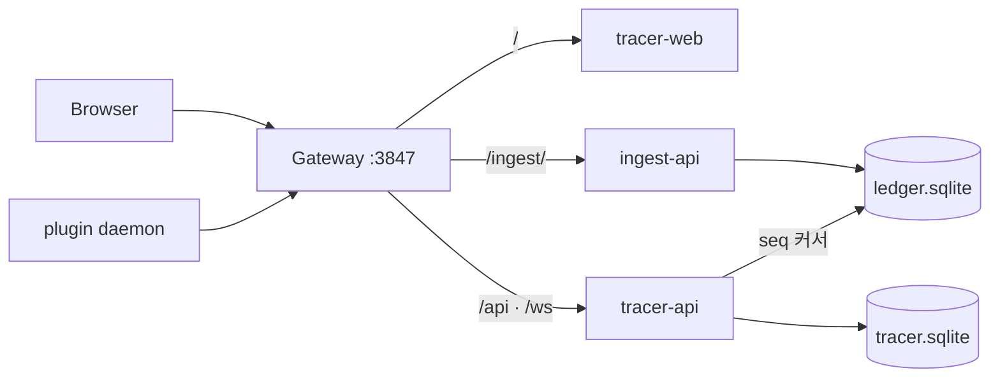

# sqlite 프로파일

이 문서는 `local-main` 브랜치에만 있는 실행 경로를 설명합니다. `main`은 이 프로파일을 갖지 않습니다. 브랜치는 `main → local-main` 한 방향으로만 합칩니다.

## 무엇인가

`sqlite`는 파드 네 개짜리 합성입니다. Postgres도 Redpanda도 Debezium도 OpenSearch도 세우지 않고, 원장과 조회 모델을 호스트 디렉터리의 sqlite 파일 두 개로 둡니다. 합성 선언은 이미지를 만드는 저장소가 갖고(`agent-tracer/compose/sqlite.yml`) 이 저장소는 실행 스크립트만 갖습니다.

`main`은 실행체를 찾는 자리만 갖습니다. `scripts/profile.runner.mjs`가 `scripts/profiles/<이름>.mjs`를 찾아 `up()`과 `down(purge)`와 `doctor(report)`에 넘기고, 그 파일이 없으면 이 저장소의 합성으로 넘깁니다. 이 브랜치가 더하는 것은 `scripts/profiles/sqlite.mjs` 하나입니다.

게이트웨이는 다른 프로파일과 같은 이미지를 그대로 씁니다. 그 상류 선언이 `tracer-api:3902`를 부르므로 조회 파드도 그 이름과 포트를 씁니다.



## 실행

```bash
node scripts/up.mjs --profile sqlite       # 네 파드를 세우고 건강해질 때까지 기다린다
node scripts/doctor.mjs --profile sqlite   # 형제 저장소와 이미지와 합성을 검사한다
node scripts/down.mjs --profile sqlite     # 파드를 내린다. 데이터 파일은 남는다
```

이미지는 이 저장소가 만들지 않습니다. 없으면 기동과 진단이 만드는 저장소의 이름을 알리고 멈춥니다.

```bash
docker compose -f "$WORKSPACE/agent-tracer/compose/sqlite.yml" build
```

| 환경변수 | 기본값 | 뜻 |
| --- | --- | --- |
| `AGENT_TRACER_REPO` | `../agent-tracer` | 합성과 이미지를 갖는 형제 저장소 |
| `MONITOR_LOCAL_DIR` | `~/.agent-tracer/local` | 두 파드가 함께 보는 호스트 디렉터리 |
| `MONITOR_LOCAL_PORT` | `3847` | 단일 진입점 |

로그는 `docker compose -p agent-tracer logs` 로 봅니다.

`--volumes`는 이 프로파일에서 거절합니다. 데이터가 도커 볼륨이 아니라 호스트 파일이므로 지울 때는 데이터 디렉터리를 직접 지웁니다.

다른 프로파일과 같은 프로젝트 이름과 같은 포트를 쓰므로 `tracer` 와 동시에 띄울 수 없습니다.

## 무엇을 아끼는가

같은 기계에서 잰 값입니다.

```text
node scripts/up.mjs --profile tracer     1,929 MiB   컨테이너 11개
node scripts/up.mjs --profile sqlite       428 MiB   컨테이너 4개
```

줄어든 대부분은 없앤 기반입니다. `tracer` 프로파일에서 OpenSearch가 648 MiB, Connect가 403 MiB, Redpanda가 180 MiB를 씁니다. 남은 넷 가운데 조회와 수집이 419 MiB 를 쓰고 게이트웨이와 화면은 합쳐 8 MiB 입니다.

대시보드 화면은 그대로 열립니다. 대신 전문 검색과 CDC 재투영과 에이전트 상류가 없습니다. `/api/v1/search/*` 는 빈 결과를 내고 `/api/agent/*` 는 `501` 입니다. 그 가운데 하나라도 필요하면 `--profile tracer` 를 씁니다.

## 백업

데이터는 원장에서 다시 만들어지는 것과 그렇지 않은 것으로 갈립니다. `tasks`·`sessions`·`events`·`turns`·`recipe_applications`·`verdicts`는 투영이 원장에서 다시 세우므로 백업하지 않습니다. `users`·`recipes`·`rules`·`memos`·`tags`·`task_tags`·`task_user_state`·`task_cleanup_suggestions`는 화면과 데몬이 만들고 원장에 남지 않아 **원장을 재생해도 되살아나지 않습니다.**

sqlite 프로파일에서는 호스트 디렉터리의 두 파일이 전부이므로 파드를 내린 뒤 그 디렉터리를 복사합니다.

```bash
node scripts/down.mjs --profile sqlite
cp -R ~/.agent-tracer/local ~/backup-$(date +%Y%m%d)
```

Compose 프로파일에서는 `event-db`의 `runtime`과 `tracer-db`의 `tracer`를 덤프합니다. OpenSearch는 재색인으로 세우므로 백업 대상이 아닙니다.

```bash
docker exec -i agent-tracer-event-db-1  pg_dump -U root runtime > runtime.sql
docker exec -i agent-tracer-tracer-db-1 pg_dump -U root tracer  > tracer.sql
```

`node scripts/down.mjs`는 볼륨을 남기므로 다시 띄우면 데이터가 그대로입니다. **`--volumes`는 수집·조회·에이전트·Temporal 원장을 모두 지웁니다.** 지우기 전에 위 덤프를 뜹니다.

## 이관

`sqlite`에서 Compose 프로파일로 옮기는 절차는 `agent-tracer`의 `local.export.main.ts`와 `local.import.main.ts`가 갖습니다. 이 저장소는 스택만 세웁니다.

```bash
WORKSPACE=/path/to/workspace

cd "$WORKSPACE/agent-tracer"
MONITOR_PROFILE=sqlite LOCAL_EXPORT_DIR=./local-export \
  SWC_NODE_PROJECT=services/tracer-api/tsconfig.json \
  node --import @swc-node/register/esm-register services/tracer-api/src/local.export.main.ts

cd "$WORKSPACE/agent-tracer-stack"
node scripts/down.mjs --profile sqlite
node scripts/up.mjs --profile tracer

cd "$WORKSPACE/agent-tracer"
MONITOR_PROFILE=prd POSTGRES_USER=root POSTGRES_PASSWORD=root \
  TRACER_DB_HOST=127.0.0.1 TRACER_DB_PORT=5433 \
  LOCAL_EXPORT_DIR=./local-export INGEST_BASE_URL=http://127.0.0.1:3847 \
  REPLAY_USER_ID="$(id -un)" \
  SWC_NODE_PROJECT=services/tracer-api/tsconfig.json \
  node --import @swc-node/register/esm-register services/tracer-api/src/local.import.main.ts
```

넣는 순서는 사용자 소유 테이블 → 원장 재생 → 검색 색인 요청입니다. 규칙이 판정보다 먼저 서야 하고, 색인 요청은 투영이 만든 문서를 덮어써야 아카이브 같은 사용자 상태가 남습니다. 세 단계 모두 다시 실행해도 겹치지 않습니다.

이관 뒤에는 조회 모델과 검색을 함께 확인합니다.

```bash
curl -s -H "x-monitor-user: $(id -un)" 'http://127.0.0.1:3847/api/v1/tasks?limit=5'
curl -s 'http://127.0.0.1:9200/_cat/indices?h=index,docs.count'
```

`recipes-v1`과 `memos-v1`의 건수가 0이면 아웃박스가 아직 배출되지 않은 것입니다. 배출은 주기 작업이라 잠시 뒤 다시 셉니다.
