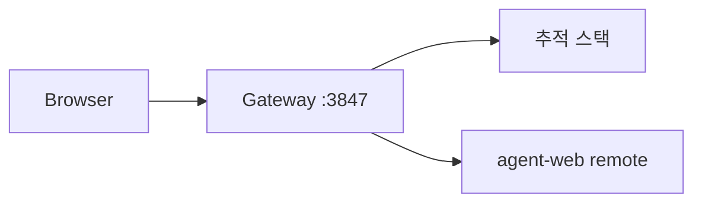
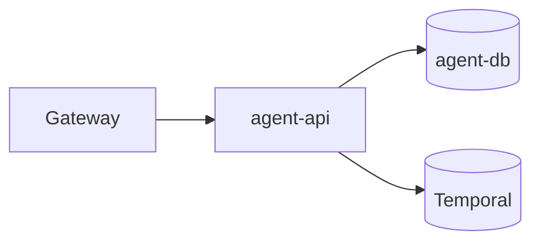
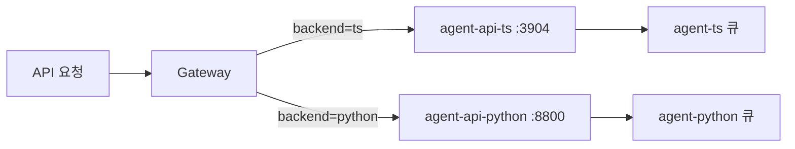

# agent-tracer-stack

추적 스택과 에이전트 서비스를 함께 띄우는 배포 합성입니다. 서비스 구성, 게이트웨이 상류 선언, 저장소별 이미지 태그 고정, 구현체 교체 절차, 계측 오버레이를 소유합니다. 애플리케이션 소스와 이미지는 각 저장소가 만들고 여기서는 `versions.lock`이 그 태그를 가리킵니다.

추적 스택은 이 저장소 없이도 단독으로 뜹니다. 여기가 필요한 것은 에이전트 서비스를 함께 띄울 때입니다. 에이전트 구현체는 한 프로파일에서 하나만 올라가며 교체해도 데이터베이스와 큐는 그대로 남습니다. `compare`만 두 구현체를 나란히 세우고 큐 접두사를 축마다 나눕니다.

## 구성



### 에이전트 프로파일



### compare 라우팅



추적 스택은 `event-db`, `tracer-db`, Redpanda, Debezium Connect, OpenSearch, `ingest-api`, `tracer-api`, `projector`, `tracer-web`, 게이트웨이로 이루어집니다. 에이전트 프로파일은 여기에 `agent-db`, Temporal, 에이전트 API, chat·jobs·generate 워커, 에이전트 화면 리모트를 더합니다.

## 요구 사항

- Docker Engine과 Docker Compose v2
- Node.js `>=24.0.0 <25.0.0` — `scripts/*.mjs` 실행용이며 구현체 저장소와 같은 기준입니다
- `ts`·`python`·`compare` 프로파일에는 해당 저장소에서 빌드한 이미지
- `--monitoring`에는 추가 컨테이너와 디스크 여유

## 이미지 준비

`scripts/up.mjs`는 이미지를 빌드하지도 pull 하지도 않습니다. `versions.lock`의 이름과 태그에 맞는 이미지를 먼저 로컬에 준비합니다.

```bash
# 여섯 저장소가 모여 있는 작업 공간 루트에서 실행
WORKSPACE=/path/to/workspace

docker compose -f "$WORKSPACE/agent-tracer/compose/base.yml" build
docker build -t tracer-agent-ts:latest "$WORKSPACE/tracer-agent/tracer-agent-ts"
docker build -t tracer-agent-web:latest "$WORKSPACE/tracer-agent/tracer-agent-web"
docker build -t tracer-agent-python:latest "$WORKSPACE/tracer-agent/tracer-agent-python"

cd "$WORKSPACE/agent-tracer-stack"
```

둘째 스택은 이름이 붙은 태그를 읽습니다. `node scripts/pin.mjs --stack b`가 지금 만들어진 이미지에 그 이름을 붙이므로, 이후의 빌드가 `:latest`를 다시 써도 둘째 스택이 보는 이미지는 그대로입니다.

각 디렉터리는 서로 다른 git 저장소입니다. clone 위치가 다르면 `WORKSPACE` 아래의 네 경로만 실제 위치로 바꿉니다. 배포에서는 `versions.lock`의 `:latest`를 릴리스 태그나 digest로 고정합니다. 이 파일은 이미지 참조를 한곳에 모으지만 이미지 내용의 불변성까지 보장하지는 않습니다.

## 실행과 운영

```bash
node scripts/up.mjs --profile tracer      # 추적 스택만. 에이전트 경로는 501
node scripts/up.mjs --profile ts          # TypeScript 구현체를 함께
node scripts/up.mjs --profile python      # Python 구현체를 함께
node scripts/up.mjs --profile compare     # 두 구현체를 나란히
node scripts/up.mjs --profile ts --monitoring
node scripts/up.mjs --profile compare --local   # TypeScript 축을 사용자 구독 자격으로

node scripts/doctor.mjs --profile ts      # 이미지와 합성과 상류 선언을 검사
node scripts/doctor.mjs --profile ts --skip-images
node scripts/conformance.mjs              # 두 구현체의 적합성 스위트를 나란히 실행
node scripts/switch.mjs python            # 원장과 큐를 그대로 두고 구현체만 교체
node scripts/switch.mjs ts
node scripts/down.mjs                     # 전부 내린다. 데이터는 남는다
node scripts/down.mjs --volumes           # 볼륨까지 지운다

node scripts/pin.mjs --stack b            # 둘째 스택이 읽을 이미지 이름을 고정
node scripts/up.mjs --profile ts --stack b   # 프로젝트와 포트와 태그를 갈아 나란히
node scripts/down.mjs --stack b
```

`tracer` 프로파일에는 에이전트 상류가 없으므로 `/api/agent/*`가 `501`을 돌려주고 `/agent/*` 화면은 제공되지 않습니다.

`compare`는 두 접수구를 함께 세우고 게이트웨이가 축을 가릅니다. 기본 축이 없으므로 반드시 지정합니다.

```text
/api/agent/jobs?backend=ts
/api/agent/jobs?backend=python
```

축이 없는 요청은 어느 구현체도 임의로 고르지 않고 `400 agent_backend_ambiguous`로 거절합니다. 큐 접두사가 축마다 달라 같은 실행을 두 번 가져가지 않으며, 원장은 하나라 두 축의 결과가 한 화면에 함께 쌓입니다.

**진행 중인 대화 턴을 남긴 채 구현체를 교체하거나 `compare`로 들어가지 않습니다.** 두 대화 워커가 같은 원장과 워크플로 이력을 보므로 부팅 복구가 활성 턴을 두 번 되살립니다.

에이전트 Compose 프로파일은 기본적으로 `MONITOR_PROFILE=prd`로 실행됩니다. 사용자의 Claude 구독 자격으로 TypeScript 축을 실행하려면 `--local`을 씁니다. `ts`와 `compare`에서만 쓸 수 있고 다른 프로파일에서는 거절합니다.

```bash
claude setup-token
export CLAUDE_CODE_OAUTH_TOKEN="..."
node scripts/up.mjs --profile ts --local
node scripts/up.mjs --profile compare --local
```

토큰은 Claude CLI를 하위 프로세스로 실행하는 chat·jobs·generate 워커만 받습니다. 접수와 검증만 하는 API는 프로파일만 받고, Python 축과 추적 서비스와 게이트웨이는 그대로입니다. `compare --local`에서도 요청은 `backend`를 지정해야 하며 지정하지 않으면 `400 agent_backend_ambiguous`입니다.

## 포트

| 주소 | 용도 | 프로파일 |
| --- | --- | --- |
| `127.0.0.1:3847` | 게이트웨이와 추적 대시보드 | 항상 |
| `localhost:5432` | event-db | 항상 |
| `localhost:5433` | tracer-db | 항상 |
| `localhost:5434` | agent-db | 에이전트 |
| `localhost:8081` | Adminer | 항상 |
| `localhost:8083` | Debezium Connect | 항상 |
| `localhost:8233` | Temporal UI | 에이전트 |
| `localhost:9200` | OpenSearch | 항상 |
| `localhost:19092` | Redpanda 외부 Kafka 포트 | 항상 |
| `127.0.0.1:3000` | Grafana | `--monitoring` |
| `127.0.0.1:9090` | Prometheus | `--monitoring` |

표의 주소는 이름 없는 스택의 것입니다. `--stack b`는 프로젝트를 `agent-tracer-b`로 두고 공개 포트를 100만큼 옮기며 이미지 태그에 `-b`를 붙이므로, 게이트웨이는 `127.0.0.1:3947`에 열립니다. 컨테이너 안쪽 포트는 그대로입니다.

브라우저가 보는 것은 게이트웨이 하나입니다. Adminer는 로그인 화면의 목록에서 서버를 고르며 기본 자격 증명은 Compose의 `POSTGRES_USER`와 `POSTGRES_PASSWORD`, 곧 `root` / `root`입니다. 개발이 아닌 자리에서는 운영 자격 증명으로 바꿉니다.

```text
tracer-db    tracer     추적 조회 모델
event-db     runtime    수집 이벤트 원장
agent-db     agent      에이전트 실행 원장
temporal-db  temporal   워크플로 이력
```

뒤의 둘은 에이전트를 함께 띄우는 프로파일에서만 닿습니다.

## 환경변수

포트는 published-port 변수로 바꿉니다.

```text
GATEWAY_PUBLISHED_PORT       EVENT_DB_PUBLISHED_PORT     TRACER_DB_PUBLISHED_PORT
AGENT_DB_PUBLISHED_PORT      REDPANDA_PUBLISHED_PORT     ADMINER_PUBLISHED_PORT
CONNECT_PUBLISHED_PORT       OPENSEARCH_PUBLISHED_PORT   TEMPORAL_PUBLISHED_PORT
TEMPORAL_UI_PUBLISHED_PORT   GRAFANA_PUBLISHED_PORT      PROMETHEUS_PUBLISHED_PORT
```

공통 데이터베이스 자격 증명은 `POSTGRES_USER`와 `POSTGRES_PASSWORD`가 갖습니다. 에이전트 큐 접두사는 `AGENT_TASK_QUEUE_PREFIX`이며, `compare`에서는 `COMPARE_TS_QUEUE_PREFIX`와 `COMPARE_PYTHON_QUEUE_PREFIX`를 각각 지정합니다. Python 축의 LangSmith 연동은 `LANGSMITH_TRACING`, `LANGSMITH_ENDPOINT`, `LANGSMITH_API_KEY`, `LANGSMITH_PROJECT`, `LANGSMITH_WORKSPACE_ID`를 사용합니다.

## 계측 오버레이

`--monitoring`은 Grafana만 더하지 않습니다. OpenTelemetry Collector, Tempo, Loki, Alloy, Prometheus, Alertmanager, PostgreSQL·OpenSearch·Kafka·SQL exporter를 함께 올립니다. 기본 보존은 Prometheus 15일, Loki 7일, Tempo 48시간이며 대시보드는 `127.0.0.1:3000`에 열립니다.

## 저장소 구조

```text
agent-tracer-stack/
├── compose/                  tracer·agent·compare·monitoring 합성
├── gateway/
│   ├── profiles/             프로파일별 상류 원본
│   └── stacks/               스택마다 실행 시 생성되는 상류와 리모트 선언
├── monitoring/               OTel·Prometheus·Grafana·Loki·Tempo 설정
├── adminer/                  Adminer 로그인 보조 설정
├── scripts/                  up·down·switch·doctor·conformance·pin
└── versions.lock             애플리케이션 이미지 참조
```

## 컨벤션과 검증

Compose의 앱 이미지 태그는 파일에 직접 쓰지 않고 `versions.lock`이 갖습니다. 프로파일을 더하거나 바꿀 때는 `scripts/stack.mjs`의 합성 목록과 상류 선택을 함께 갱신합니다. NGINX 상류는 `gateway/profiles/*.map`에 선언하고 생성 산출물인 `gateway/stacks/`를 직접 고치지 않습니다. `compare`에서 서비스와 큐와 게이트웨이 이름은 축을 분명히 담습니다.

```bash
node --test "scripts/**/*.test.mjs"
for profile in tracer ts python compare; do
  node scripts/doctor.mjs --profile "$profile" --skip-images
done
```

## 관련 저장소

- [agent-tracer](https://github.com/agent-tracer/agent-tracer) — 추적 플랫폼 이미지와 API·대시보드
- [tracer-agent-contract](https://github.com/agent-tracer/tracer-agent-contract) — 두 구현체가 공유하는 계약
- [tracer-agent-ts](https://github.com/agent-tracer/tracer-agent-ts) — TypeScript 에이전트 이미지
- [tracer-agent-python](https://github.com/agent-tracer/tracer-agent-python) — Python 에이전트 이미지
- [tracer-agent-web](https://github.com/agent-tracer/tracer-agent-web) — 에이전트 화면 리모트

## 라이선스

MIT License
